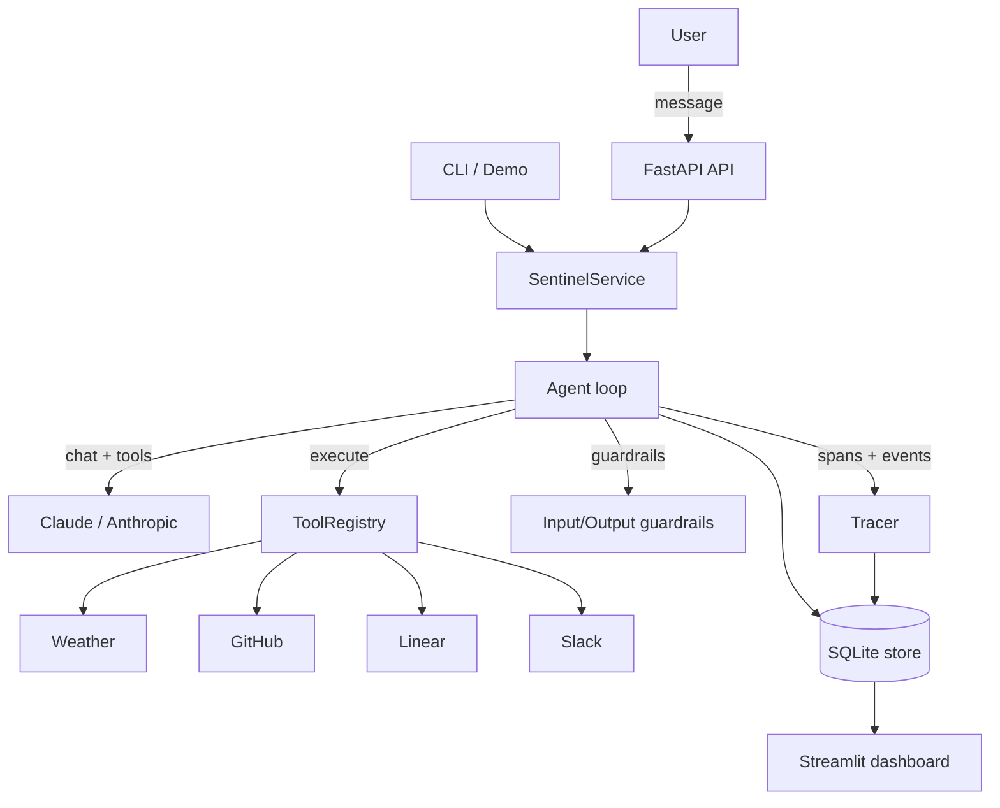

# 🛡️ Sentinel

A **reliable, observable multi-tool AI agent**. Sentinel wraps Claude with a
hardened tool-calling loop, full OpenTelemetry-style GenAI tracing, durable
session state, guardrails, and graceful degradation — plus an observability
dashboard that visualizes every LLM call and tool invocation as a span
waterfall.

The point of this project is not "an agent that calls tools." The point is an
agent that **never silently fails**, **always tells you what it tried and what
broke**, and **records a full, inspectable trace of every decision**.

---

## Why it exists

Most agent demos work great until a tool times out, an API key is missing, or
the model loops forever. Sentinel is built around the failure cases:

- A tool **never raises** — it always returns a structured `ToolResult`.
- A missing API key is a **graceful "unavailable"**, not a crash.
- Transient errors are **retried with backoff**, and each retry is a span.
- The loop has a **max-steps budget** so it can't spin forever.
- When tools fail, the agent **completes what it can and reports the rest**.
- Every turn produces a **trace** you can replay in the dashboard.

---

## Architecture



### The agent loop

```
user message
  ├─ input guardrail ........ block injection / oversize input
  └─ loop (bounded by max_steps):
       ├─ call Claude with tool schemas      → LLM span
       ├─ if tool_use:
       │     ├─ execute each tool            → tool span
       │     │     └─ retries (tenacity)     → retry spans
       │     └─ feed tool_results back (errors included)
       └─ else end_turn → done
  ├─ output guardrail ....... redact leaked credentials, check shape
  └─ persist turn + trace + session (SQLite)
```

A **trace** is the full span tree for one turn:

```
turn (root)
├── chat <model>            in/out tokens, cost, latency
├── execute_tool github     ok/fail, attempts, latency
│   └── retry github #2      error, backoff
└── chat <model>
```

Span attributes follow the
[OpenTelemetry GenAI semantic conventions](https://opentelemetry.io/docs/specs/semconv/gen-ai/)
(`gen_ai.system`, `gen_ai.request.model`, `gen_ai.usage.input_tokens`, …) plus
a few `sentinel.*` extensions for cost, retries, and tool availability.

---

## Project layout

```
src/sentinel/
├── config.py            # settings + model pricing/cost
├── models.py            # all shared Pydantic models (the contracts)
├── tools/               # BaseTool, ToolRegistry, 4 tools (never raise)
│   ├── base.py
│   ├── weather.py       # no API key needed (smoke test)
│   ├── github.py
│   ├── linear.py
│   └── slack.py
├── llm/client.py        # Anthropic wrapper behind a testable interface
├── agent/
│   ├── loop.py          # the multi-turn loop + graceful degradation
│   └── guardrails.py    # input + output guardrails
├── observability/
│   └── tracing.py       # Tracer: spans + events (OTel GenAI flavored)
├── state/
│   ├── db.py            # SQLite schema
│   └── store.py         # async persistence (sessions/turns/traces/spans)
├── api/                 # FastAPI app + schemas
├── console.py           # rich trace/waterfall rendering
├── service.py           # orchestration used by API + CLI
└── cli.py               # typer CLI
dashboard/app.py         # Streamlit observability dashboard (4 views)
demo/demo.py             # scripted end-to-end demo
tests/                   # reliability test suite
```

---

## Setup

Requires Python 3.11+.

```bash
python -m venv .venv && source .venv/bin/activate
pip install -e ".[dev,dashboard]"
cp .env.example .env        # then fill in any keys you have
```

The only key needed to actually call the model is `ANTHROPIC_API_KEY`. Every
tool key is optional — without it, that tool reports "unavailable" and the
agent degrades gracefully. The **weather tool needs no key**, so you can smoke
test the whole pipeline immediately.

---

## Run

**Demo (works fully offline with a scripted model):**

```bash
python demo/demo.py
```

It runs a 3-turn conversation that exercises all four tools, prints a live
turn-by-turn trace, and ends with a cost/latency/reliability summary.

**CLI:**

```bash
sentinel tools                       # list tools + availability
sentinel chat "What's the weather in Tokyo?"
sentinel sessions                    # list past sessions
sentinel trace <trace_id>            # render a stored trace
```

**API:**

```bash
uvicorn sentinel.api.app:app --reload
# docs at http://localhost:8000/docs
```

**Dashboard:**

```bash
streamlit run dashboard/app.py
# or point at a specific db:
SENTINEL_DB_PATH=/tmp/sentinel_demo.db streamlit run dashboard/app.py
```

**Docker (API + dashboard):**

```bash
docker compose up --build
# API → :8000, dashboard → :8501
```

---

## API

| Method | Path | Description |
| --- | --- | --- |
| `POST` | `/sessions` | Start a session |
| `GET`  | `/sessions` | List all sessions |
| `GET`  | `/sessions/{id}` | Session + full message history |
| `POST` | `/sessions/{id}/messages` | Send a message (runs a turn) |
| `GET`  | `/sessions/{id}/turns` | List a session's turns |
| `GET`  | `/traces` | List all traces |
| `GET`  | `/traces/{id}` | Full trace (span tree) |
| `GET`  | `/sessions/{id}/turns/{idx}/trace` | Trace for a specific turn |

All endpoints are async, validated by Pydantic, and return **structured JSON
errors** (`{"error": ..., "detail": ...}`) — never stack traces.

---

## Dashboard views

1. **Sessions** — every session with cost, turn count, and status.
2. **Turn inspector** — the full tool-call sequence for a turn, with latency
   and outcome per call.
3. **Trace viewer** — the span tree for a turn as a waterfall diagram (LLM
   calls and tool calls with timing).
4. **Cost & reliability** — cumulative spend over time, tool success rate,
   average retries per tool, and p50/p99 latency per tool.

---

## Reliability guarantees

Sentinel makes these promises, each backed by a test in `tests/`:

1. **Tools never raise.** `BaseTool.run()` always returns a `ToolResult`, even
   when the underlying call throws. *(test_tools.py)*
2. **Missing credentials degrade gracefully.** A tool without its key returns
   `unavailable=True` and is never invoked. *(test_tools.py)*
3. **Retries are bounded and observable.** Transient failures retry with
   exponential backoff exactly `tool_max_attempts` times; each retry is a child
   span. *(test_tools.py, test_agent.py)*
4. **The loop is bounded.** A `max_steps` budget prevents infinite tool loops.
5. **Partial failure is reported, not dropped.** When one of several tools
   fails, the turn still completes and the response says what failed.
   *(test_agent.py)*
6. **Guardrails block bad input before the LLM.** Prompt-injection attempts and
   oversize messages are rejected without calling the model. *(test_guardrails.py)*
7. **Credentials never leak in output.** The output guardrail redacts any
   configured secret from the response. *(test_guardrails.py)*
8. **State survives restarts.** Sessions and traces persist to SQLite; an agent
   can resume a session by id with full prior context. *(test_state.py)*
9. **Cost accounting is accurate.** Token and cost totals accumulate correctly
   across a multi-turn session. *(test_agent.py)*

Run them:

```bash
pytest
```

---

## Failure modes handled

| Failure | How Sentinel responds |
| --- | --- |
| Tool raises an exception | Caught by `run()`; returned as a failed `ToolResult`; fed back to the model as an `is_error` tool result so it can explain. |
| Tool API key missing | Tool reports `unavailable`; never invoked; agent tells the user which integration isn't configured. |
| Transient network error / 5xx | Retried with exponential backoff up to `tool_max_attempts`; each attempt recorded as a retry span. |
| Auth / 4xx error | Treated as non-retryable; surfaced immediately as a failure. |
| Several tools fail in one turn | Turn still completes; the response reports each tool's outcome individually. |
| Unknown tool requested by model | Returns a failed `ToolResult("unknown tool")` instead of crashing the loop. |
| Model loops forever on tools | `max_steps` budget ends the turn with a degradation summary. |
| Prompt injection / jailbreak | Input guardrail blocks the turn before any LLM call. |
| Oversized / empty input | Input guardrail rejects with a clear reason. |
| Credential leak in a response | Output guardrail redacts it and flags a `credential_leak` span. |
| Unexpected internal error mid-turn | Turn-level safety net marks the turn `failed`, returns a structured message, and still persists the trace. |
| `ANTHROPIC_API_KEY` missing | API returns a structured `503 llm_unavailable`; the demo falls back to a scripted offline model. |
| Process restart | Session + traces reload from SQLite; conversation resumes with full context. |

---

## Configuration

All via environment / `.env` (see `.env.example`):

| Variable | Default | Purpose |
| --- | --- | --- |
| `ANTHROPIC_API_KEY` | — | Required to call Claude |
| `SENTINEL_MODEL` | `claude-sonnet-4-20250514` | Model id |
| `SENTINEL_MAX_TOKENS` | `2048` | Max output tokens per call |
| `SENTINEL_MAX_STEPS` | `8` | Tool-loop budget per turn |
| `SENTINEL_DB_PATH` | `sentinel.db` | SQLite path |
| `SENTINEL_MAX_INPUT_CHARS` | `8000` | Input length guardrail |
| `SENTINEL_TOOL_MAX_ATTEMPTS` | `3` | Retries per tool call |
| `SENTINEL_TOOL_TIMEOUT_SECONDS` | `15` | Per-request timeout |
| `GITHUB_TOKEN` / `LINEAR_API_KEY` / `SLACK_BOT_TOKEN` | — | Optional tool keys |

---

## License

MIT
